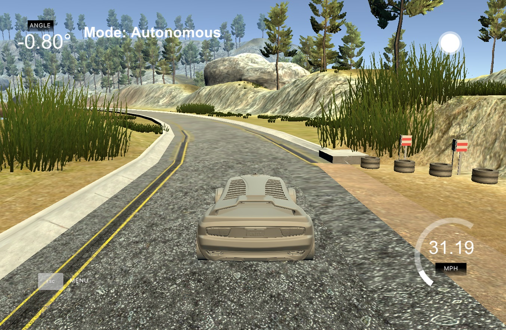

# PID Controller

Skills
---
* Control Systems
  * PID
* C++ 

Overview
---

A PID controller is implemented in C++ to provide steering agles for a car in simulation at a fixed target speed. Cross Track error and velocity are read in from the simulator and the controller feeds back a steering control in real time. 

This project was completed as an assignment for Udacity's Self Driving Car Nano Degree .

This project began with the starter code provided [here](https://github.com/udacity/CarND-PID-Control-Project)

Contents and Code Structure (All in src)
---

* main
    * Implements PID control, including tuned hyperparameters (Kp, Ki, Kd). Also interacts with the simulator, reading in cross track error/velocity, and providing calculated steering control. 
* PID
    * Defines controller object and member functions

Dependencies
---

* Udacity Term 2 Simulator, which can be downloaded [here](https://github.com/udacity/self-driving-car-sim/releases)
* uWebSocketIO
    * To accomplish this (and all dependencies) I used the Udacity Docker image on Windows. Instructions for how to do that can be found [here](https://discussions.udacity.com/t/getting-started-with-docker-and-windows-for-the-ekf-project-a-guide/320236)
        * For security reasons, the VM does not automatically open port forwarding, so you need to manually enable port 4567. This is needed for the C++ program to successfully connect to the host simulator.
      1. Port Forwarding Instructions
      2. First open up Oracle VM VirtualBox
      3. Click on the default session and select settings.
      4. Click on Network, and then Advanced.
      5. Click on Port Forwarding
      6. Click on the green plus, adds new port forwarding rule.
      7. Add a rule that assigns 4567 as both the host port and guest Port, as in the screenshot.

Build Instructions
---

Once the install for uWebSocketIO is complete, the main program can be built and run by doing the following from the project top directory.

1. mkdir build
2. cd build
3. cmake ..
4. make
5. ./pid

Other Dependencies (if not using Docker Image)
---

* cmake >= 3.5
  * All OSes: [click here for installation instructions](https://cmake.org/install/)
* make >= 4.1 (Linux, Mac), 3.81 (Windows)
  * Linux: make is installed by default on most Linux distros
  * Mac: [install Xcode command line tools to get make](https://developer.apple.com/xcode/features/)
  * Windows: [Click here for installation instructions](http://gnuwin32.sourceforge.net/packages/make.htm)
* gcc/g++ >= 5.4
  * Linux: gcc / g++ is installed by default on most Linux distros
  * Mac: same deal as make - [install Xcode command line tools](https://developer.apple.com/xcode/features/)
  * Windows: recommend using [MinGW](http://www.mingw.org/)

